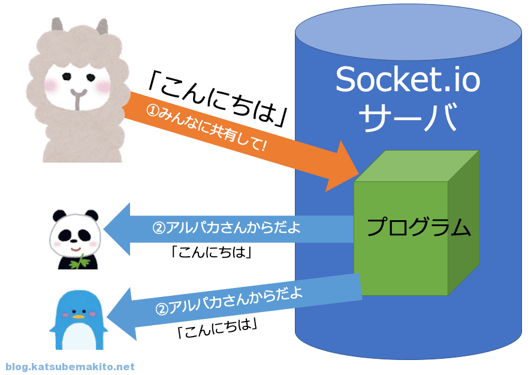

# サーバー処理
## Socket.io

* ①のような入力（情報）があったとき、②のように勝手に更新された情報をサーバーが教えてくれる点である。（つまり、更新されているかを定期的にサーバーに確認しに行く処理を書かなくてよい）

    1. ①の入力 
    
        socket.emit("post", {text: msg.value});
        
        今回は送信ボタンが押されたとき。
    2. ①をサーバーで受信し、クライアントに送信
    
        io.on("connection", (socket)=>{
            socket.on("post", (msg)=>{
                io.emit("member-post", msg);
            });
        });

        基本、connectionの中でイベントを処理。今回はpostで送られたデータを②のように一斉にクライアントに送られる。
        ※今回は自分も含まれた状態で一斉送信
    3. ②を受信し、クライアントに反映

        socket.on("member-post", (msg)=>{
        });

    まとめ. socket.ioの機能には、emit：送信とon：受信の２つのみ。

## ユーザ毎の処理の実現

* トークン
    * 例、Aさんが入室時　AさんにA：”123124124”というような適当な数字の識別子をAさんの名前と連結して記録する。（この時の適当な数字をトークンとする）
    * 記録したトークンとAさんのトークンを比べて自分と自分以外を判別する。
    * 今回トークンの生成には、socket.id（各ユーザーのセッションID）と適当な文字列からハッシュ化したものをトークンとしている。
    * 「秘密のトークン」と「公開用のトークン」に分けることでセッションハイジャックによるなりすましを防ぐ
    * 自分以外に送るときは、公開トークン（簡単なもの今回はカウントアップ）、自分に送るときは、秘密トークン（ハッシュ化したもの）
    * 自分以外に送信する場合は
        socket.broadcast.emit("member-post", msg);
        
        のように、 broadcast で可能。

* トークンの管理
    * サーバー側で、箱を用意（今回はリスト）。

        "socket.id": {token:"abcd", name:"foo", count:1},

        のように蓄積。

* 入退室の管理
    * 入出時、クライアント側にも箱を用意（今回はリスト）。

        "token": name
        
        のように蓄積
    * 退出時、クライアント側とサーバ側の両方でリストの delete を実行

        
